# CS471 - Lab 4
## HTML and CSS (Part 1)

This lab demonstrates:
- HTML pages
- CSS styling
- Django static files
- Template inheritance
- Reusable layouts using `base.html`
- Shared header and footer using `include`

## Screenshots

### Task 1
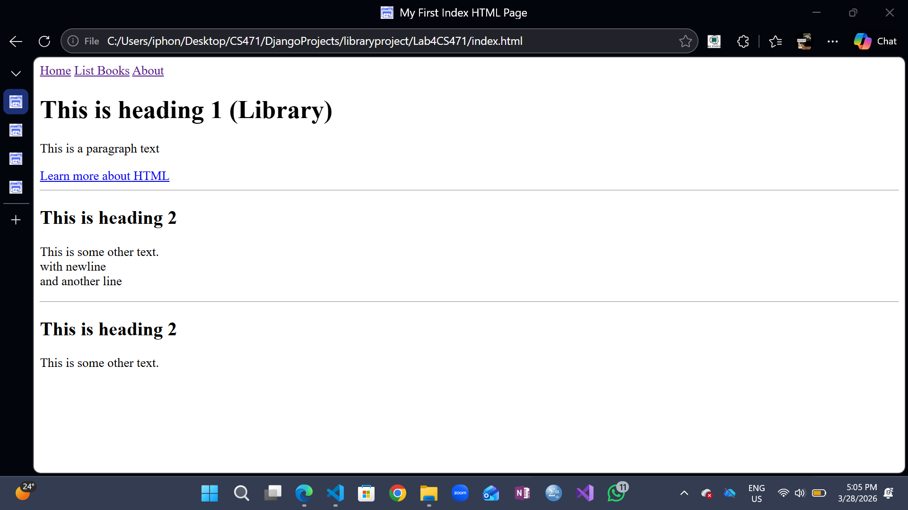
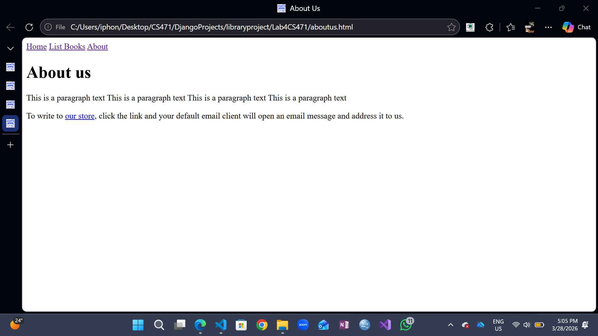
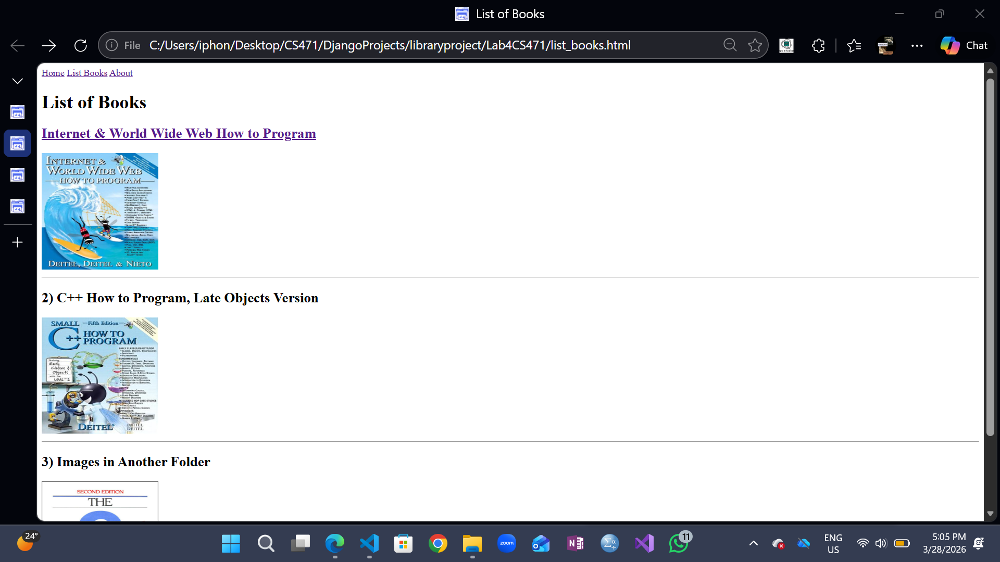

### Task 2
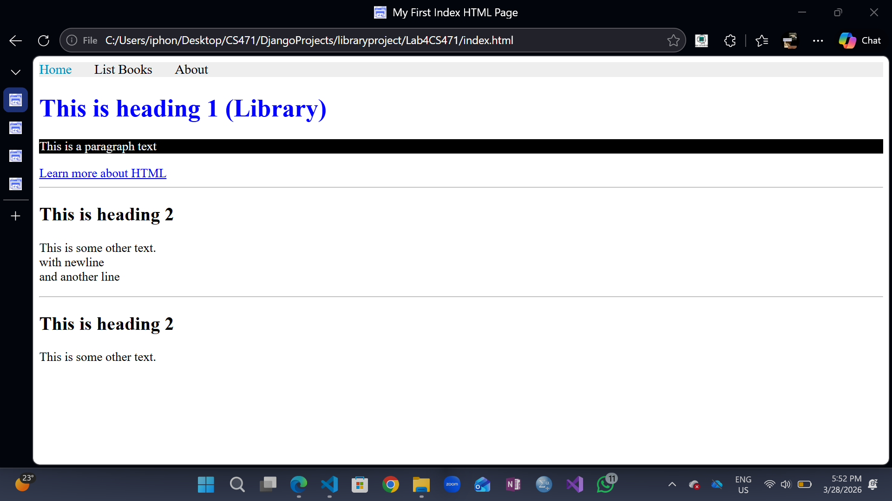
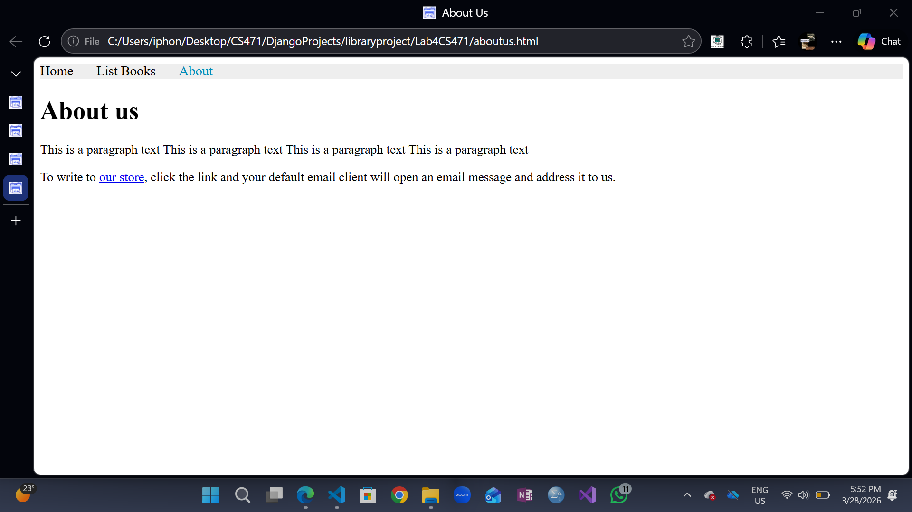
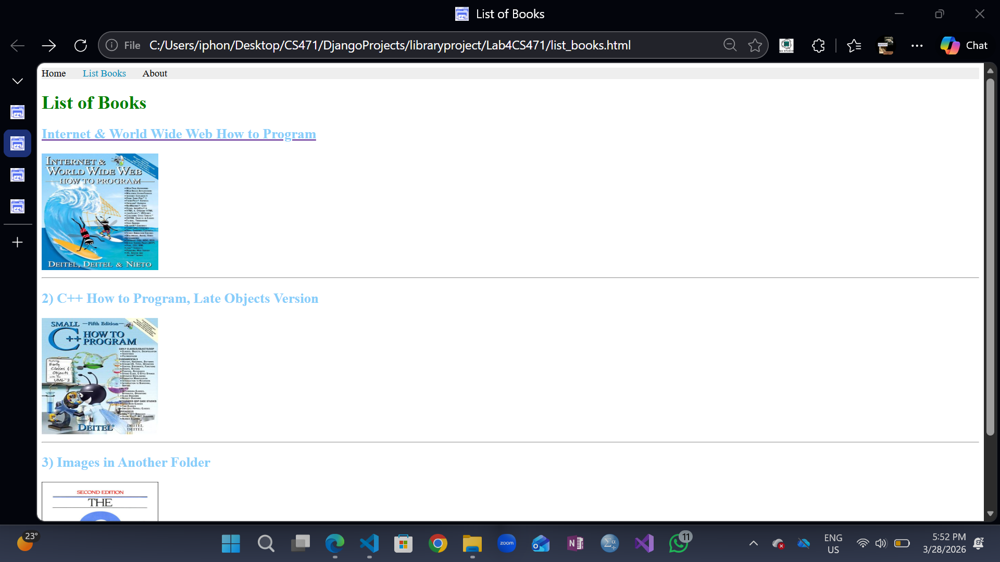
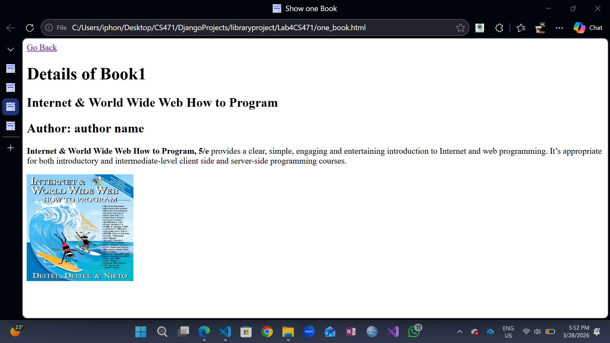

### Task 3
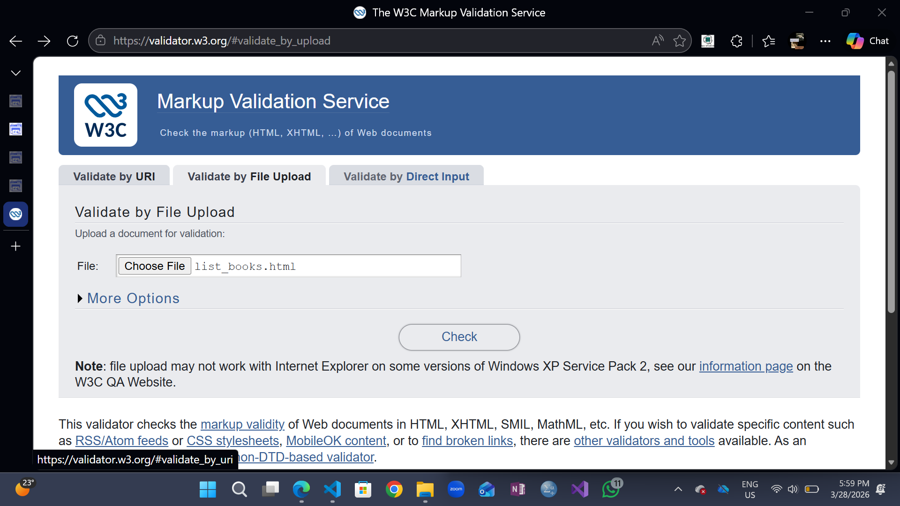
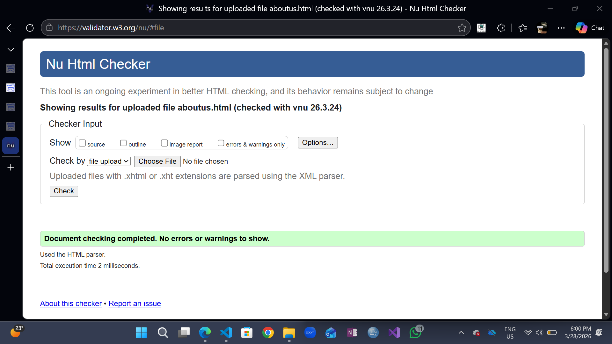

### Task 4
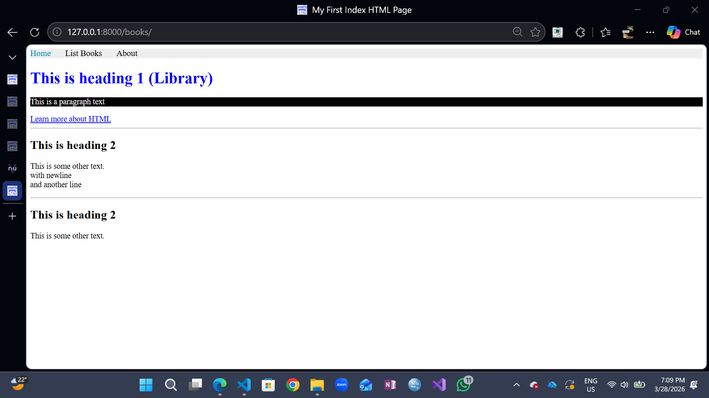
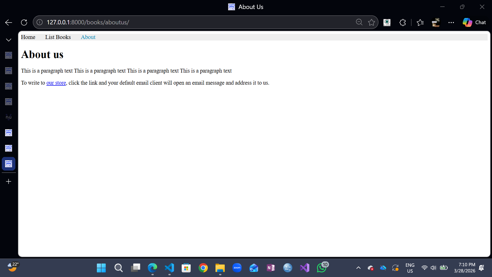
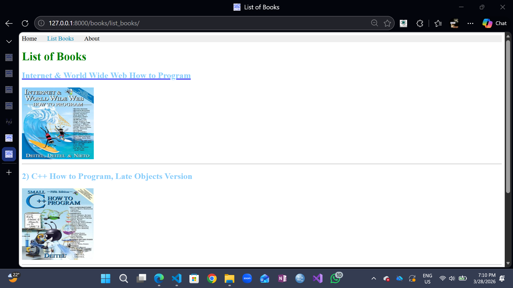
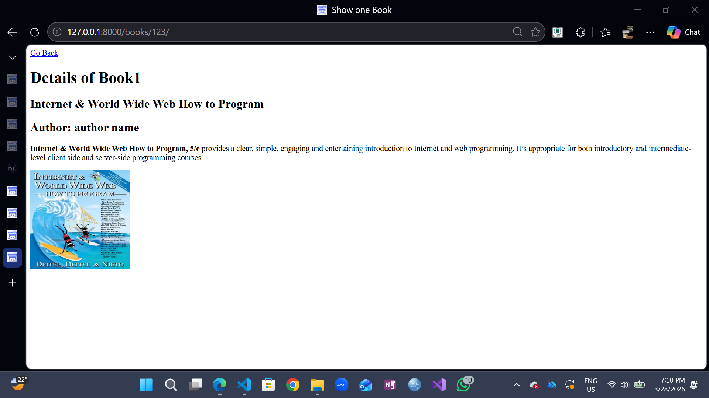

### Task 5
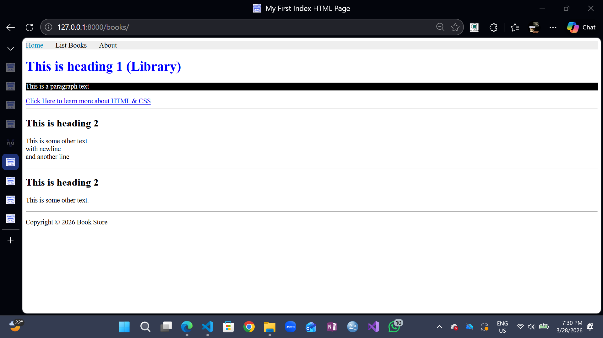
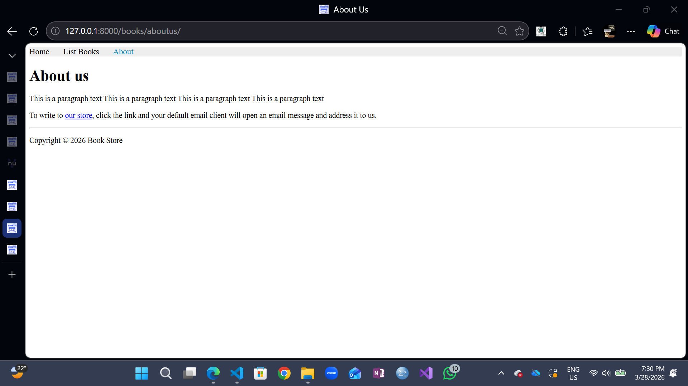
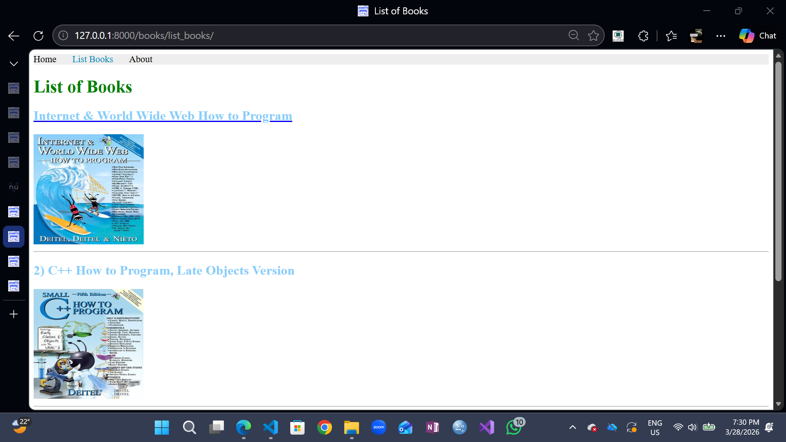
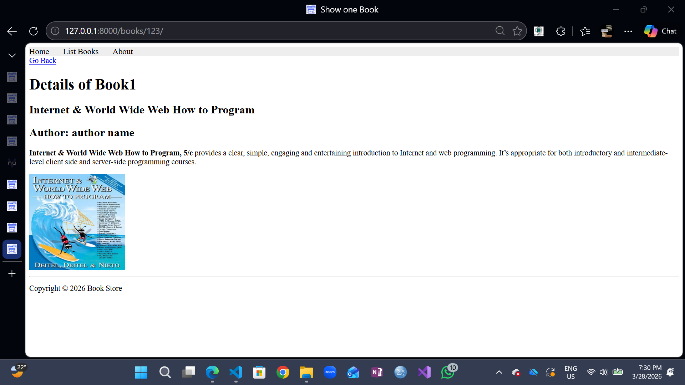